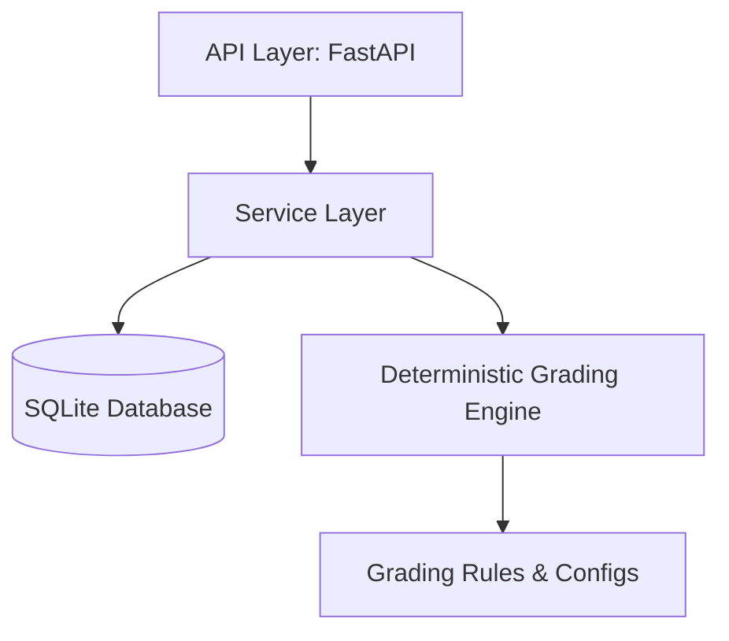

# EduGrade — School Result Processing & GPA Engine (Backend)

EduGrade is a production-quality, deterministic backend API for processing university and school examination results. It serves as the single source of truth for subject grades, grade points, GPA overrides, cap calculations, checking lists, and explanation traces.

---

## 1. Project Architecture

The project is structured according to a strict clean architecture:

```text
HTTP / API Layer (FastAPI)
       │
       ▼
Service Layer (Processors, Checking Lists, Analytics)
       │
       ▼
Deterministic Grading Engine (Stateless Business Logic)
       │
       ▼
Rules & Configuration (Constants, Thresholds, Boundaries)
```

### Architecture Diagram



---

## 2. Core Grading Logic & Rules

Every result processed is purely deterministic and traceable.

### 2.1 Grade Point Mappings
Subject total marks are mapped according to the following strict boundary definitions:
* **80–100** → GP 5.0 → A+
* **70–79**  → GP 4.0 → A
* **60–69**  → GP 3.5 → A-
* **50–59**  → GP 3.0 → B
* **40–49**  → GP 2.0 → C
* **33–39**  → GP 1.0 → D
* **0–32**   → GP 0.0 → F

### 2.2 Practical Subjects
Subjects like `PHY` (Physics), `CHE` (Chemistry), and `BIO` (Biology) enforce separate theory and practical thresholds:
* **Theory Max**: 75 (Minimum required to pass: **25**)
* **Practical Max**: 25 (Minimum required to pass: **8**)
* If a student fails *either* minimum, the subject status is `FAIL` with `GP = 0.0` and grade `F`, regardless of whether the combined sum would have passed.

### 2.3 AB / Absence Handling
Absences are explicitly preserved as `"AB"` and are *never* converted to numeric `0`.
* **Compulsory Subject Absent**: Status = `ABSENT`, GP = `0.0`, triggering an overall result of `Final GPA = 0.00` and grade `F`.
* **Optional Subject Absent**: Optional contribution = `0.0`. It does not independently trigger an overall failure.

### 2.4 Optional Subject Contribution
One optional subject (from `HMT`, `AGR`, `REL`) is evaluated for each student.
* **Contribution Formula**: `optional_contribution = max(0.0, optional_gp - 2.0)`
* **GPA Formula**: `uncancelled_gpa = (sum(compulsory_gp) + optional_contribution) / 6`
* Rounded to 2 decimal places.

### 2.5 Compulsory Failure Override
If any compulsory subject has status `FAIL` or `ABSENT`, the official GPA is overridden:
* `final_gpa = 0.00`
* `final_grade = "F"`
* The `uncancelled_gpa` is preserved in the trace/summary for transparency.

### 2.6 GPA Cap
The maximum official GPA is capped:
* `final_gpa = min(uncancelled_gpa, 5.0)`

---

## 3. Database Schema

### Student Table
* `id` (Primary Key)
* `student_id` (Unique, Indexed)
* `name` (String)
* `class_name` (String, Indexed)
* `optional_subject` (String)
* `created_at` (DateTime)

### SubjectResult Table
* `id` (Primary Key)
* `student_id` (Foreign Key, Indexed)
* `subject_code` (String, Indexed)
* `subject_type` (COMPULSORY or OPTIONAL)
* `theory_mark` (Float, Nullable)
* `theory_max` (Float)
* `practical_mark` (Float, Nullable)
* `practical_max` (Float)
* `total_mark` (Float, Nullable)
* `status` (PASS/FAIL/ABSENT)
* `gp` (Float)
* `letter_grade` (String)
* `rule_code` (String)
* `explanation` (Text)

### ResultSummary Table
* `id` (Primary Key)
* `student_id` (Foreign Key, Unique)
* `uncancelled_gpa` (Float)
* `final_gpa` (Float)
* `final_grade` (String)
* `final_status` (String)
* `optional_contribution` (Float)
* `compulsory_failure` (Boolean)
* `override_applied` (Boolean)
* `override_code` (String, Nullable)
* `override_reason` (Text, Nullable)
* `engine_version` (String)

---

## 4. API Endpoints

### 4.1 Students
* `GET /students` - Paginated, filterable list of students with results (`?search=`, `?class=`, `?status=`, `?optional=`, `?page=`, `?page_size=`, `?sort=`).
* `GET /students/{student_id}` - Detailed profile.
* `GET /students/{student_id}/trace` - Step-by-step trace of GPA calculations.

### 4.2 Checking Lists
* `GET /checking-lists/optional` - Optional GP <= 2.0 threshold reviews.
* `GET /checking-lists/practical-fail` - Students who failed due to practical/theory thresholds.
* `GET /checking-lists/absent` - Absent students and consequences.

### 4.3 Batch Operations
* `POST /process` - Accept, validate, and process batch marks.
* `POST /seed/demo` - Reset DB and load 12 Edge Cases + 50 Normal Students (Idempotent).

### 4.4 Analytics
* `GET /analytics` - Aggregate statistics (pass rates, failure counts, distributions).

### 4.5 Audits
* `GET /audit` - Timestamped execution logs.

### 4.6 Verification
* `GET /tests/boundary` - Runs 30 predefined boundary test cases against the engine and returns results.

---

## 5. Local Setup & Running instructions

### Prerequisites
* Python 3.11+
* `uv` (recommended) or `pip`

### Step 1: Install Dependencies
```bash
# Create virtual environment and install packages using uv:
uv venv
uv pip install -r requirements.txt
```

### Step 2: Configure Environment Variables
Copy `.env.example` to `.env` and adjust the variables:
```bash
DATABASE_URL=sqlite:///./edugrade.db
FRONTEND_URL=http://localhost:5173
ENGINE_VERSION=1.0
GPA_ROUNDING_PRECISION=2
```

### Step 3: Run the Server
```bash
# Run the FastAPI app locally:
.venv\Scripts\uvicorn app.main:app --reload
```
Swagger UI will be available at [http://127.0.0.1:8000/docs](http://127.0.0.1:8000/docs).

### Step 4: Run Tests
```bash
# Run unit and boundary tests:
.venv\Scripts\python.exe -m pytest
```

---

## 6. Frontend Integration & Example API Response

### Example Trace Response: `GET /students/EDGE-01/trace`
```json
{
  "student_id": "EDGE-01",
  "student_name": "High Average / Compulsory Failure",
  "class_name": "9-A",
  "engine": {
    "name": "Deterministic Grading Engine",
    "version": "1.0"
  },
  "pipeline": [
    "RAW_MARKS",
    "VALIDATION",
    "SUBJECT_EVALUATION",
    "COMPULSORY_FAILURE_CHECK",
    "OPTIONAL_CONTRIBUTION",
    "UNCANCELLED_GPA",
    "FINAL_GPA",
    "LETTER_GRADE"
  ],
  "steps": [
    {
      "step": "OPTIONAL_CONTRIBUTION",
      "input": {
        "optional_subject": "HMT",
        "optional_gp": 4.0,
        "optional_status": "PASS"
      },
      "rule_code": "OPTIONAL_BONUS",
      "calculation": "max(0.0, 4.0 - 2.0) = 2.00",
      "output": {
        "optional_contribution": 2.0
      },
      "explanation": "Optional subject GP of 4.0 is above the 2.0 threshold. Contribution = max(0, 4.0 - 2.0) = +2.00 GP."
    },
    {
      "step": "FINAL_GPA",
      "input": {
        "uncancelled_gpa": 4.33,
        "has_compulsory_failure": true
      },
      "rule_code": "COMPULSORY_FAILURE",
      "calculation": "Override GPA to 0.0 if failed else min(uncancelled_gpa, 5.0) = 0.00",
      "output": {
        "final_gpa": 0.0,
        "override_applied": true,
        "override_reason": "At least one compulsory subject failed. Overridden due to: failed compulsory subject(s): BIO."
      },
      "explanation": "At least one compulsory subject failed. Overridden due to: failed compulsory subject(s): BIO."
    }
  ]
}
```
